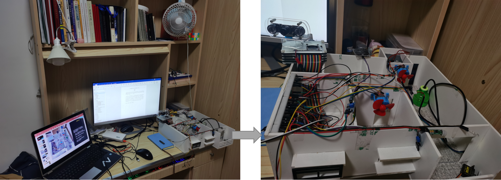
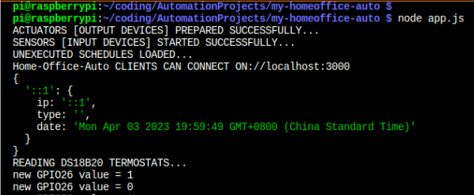

# SmartHome Design and Implementation

Design and Implementation of Smart Home with NodeJS (JavaScript) and Flask (Python).
Follow on https://youtu.be/JXRoLd9TInw.


# Final Result



# System Schematic


# Hardware Components


# Software

## Data Visualization

- Control Block


- Devices List


- Register New Device


- Tasks Scheduling and Automation


- Awaiting scheduled tasks


- Realtime Webcam Streaming


## Security Measures

- Credentials check 


- Connected Users


- Email Notifications


## Data Storage


# Run System

1. Burn Raspbian OS on your raspberry pi, connect to WiFI or LAN then Install git, your favorite IDE, MySQL/MongoDB and nodejs. visit `https://www.w3schools.com/nodejs/` for guidance.
2. Download this repo or simply clone it with ssh if available: 
    ```
        git clone git@github.com:njadNissi/raspi-smart-home-nodejs.git
    ```
    Otherwise use the https:
    ```
        git clone https://github.com/njadNissi/raspi-smart-home-nodejs
    ```
    then open the project with your favorite IDE. here the bash terminal is used, open with:
    ```
        cd raspi-smart-home-nodejs
    ```
3. Install dependencies:
    ```
        npm install
    ```
5. Create the project database: USe your favorite SQL IDE or the terminal to execute all the commands inside `read/db_tables.sql`.
6. Start the servers:
    - Open a first terminal window and run the main webserver: 
    ```
        node app.js
    ```
    - Open a second terminal window and run:
    ```
        python3 camera_client.py if webcam available:
    ```
    - Open a third terminal window and run if PWM devices control needed:
    ```
        python3 pwm_client.py
    ```



7. Login to the Webapp with your credentials as you specified in `server/controllers/security.json`


Explore the system to register available devices and sensors. To activate Email notifications, activate 2Factor-Authentication on your SMTP service provider (Gmail or QQMail are already implemented). Setup your credentials in `server/controllers/Mailer.js`.


----

Issues are welcome!
Contact me personally from the contacts on my profile if needed.
Thanks